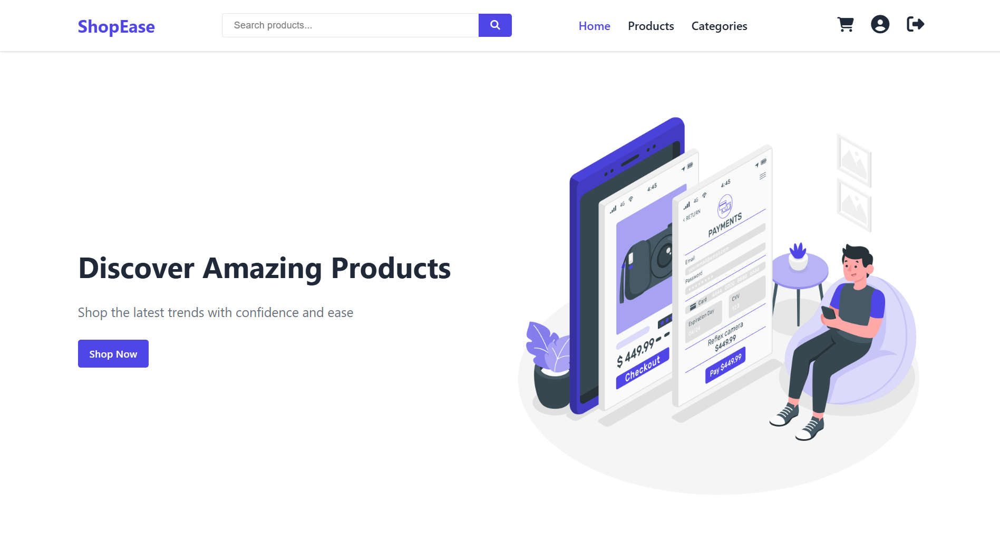
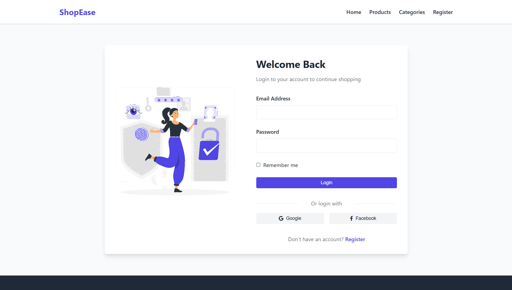
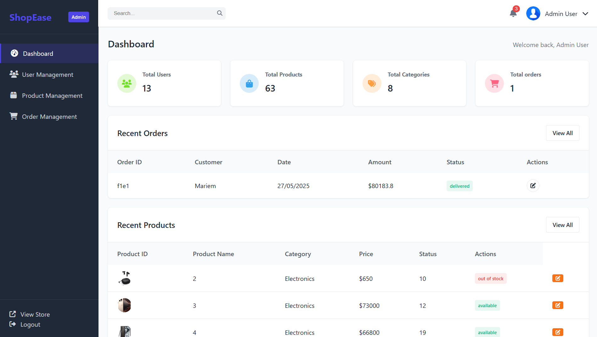

# 🛒 ShopEase

Welcome to **ShopEase** — a modern, responsive e-commerce web application built with vanilla JavaScript, HTML, and CSS. This project supports multiple user roles, product management, and a full shopping experience.

> 🛠️ This project is part of the Full-Stack .NET Training at the Information Technology Institute (ITI) Intensive Code Camp.

---

## 🚀 Features

- User Authentication: Login & Registration  
- Role-based access: Customer, Seller, Admin  
- Product catalog with categories, filtering, and detailed views  
- Shopping cart and checkout flow  
- Admin dashboard for managing users, products, orders, and categories  
- Seller dashboard for his products and orders  
- Order status updates and tracking  
- Responsive design for mobile and desktop  

---

## 🗂️ Project Structure

```
ShopEase-ITI-ECommerce-JS-Project/
├── css/
├── DB/
├── images/
├── js/
├── pages/
├── index.html
├── isProject.pdf
└── README.md
```

---

## 🎬 Demo

[](https://www.youtube.com/watch?v=f3k7rpkUzaQ)

---

## 📸 Screenshots

| Home Page | Login Page | Admin Dashboard |
|-----------|------------|------------------|
|  |  |  |

---

## ⚙️ Installation & Setup

1. Clone this repository:  
   ```bash
   git clone https://github.com/Belal-Abdrabo/ShopEase-ITI-ECommerce-JS-Project.git
   ```

2. Navigate into the directory:

   ```bash
   cd ShopEase-ITI-ECommerce-JS-Project
   ```

3. Run the JSON Server for mock backend:

   ```bash
   json-server --watch DB/databaseEcom.json --port 3000
   ```

4. Open `index.html` in your browser or serve with a live server.

---

## 🛠️ Technologies Used

- HTML5 & CSS3 (responsive layouts)
- JavaScript (ES6+)
- JSON Server (Mock backend API)
- FontAwesome
- SweetAlert2
- Vanilla JS DOM manipulation

---

## 👥 Collaboration

This project was developed collaboratively by:

- [Belal Abdrabo](mailto:belalabdrabosaid@gmail.com)
- [Ahmed Ibrahim](mailto:ahmedibrahim000074@gmail.com)  

We worked together as part of our training at the Information Technology Institute (ITI).

---

## 📄 License

This project is licensed under the MIT License.

---

## 📞 Contact

- Belal Abdrabo — [belalabdrabosaid@gmail.com](mailto:belalabdrabosaid@gmail.com)
- Ahmed Ibrahim — [ahmedibrahim000074@gmail.com](mailto:ahmedibrahim000074@gmail.com)  

---

⭐️ If you find this project useful, consider giving it a star on GitHub!
